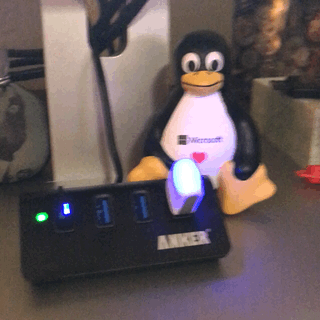

# blink(1) Azure Functions / Logic App / IoT Hub Demo # 

In Progress...

## Requirements ##

1. [Azure Subscription](https://azure.microsoft.com)
2. [Visual Studio Code](https://code.visualstudio.com/)
3. [Node.js](https://nodejs.org/en/)
4. [Azure Functions Core Tools](https://www.npmjs.com/package/azure-functions-core-tools) (optional)
5. [blink(1) USB device](https://blink1.thingm.com/)
6. Active [Twitter](https://www.twitter.com) Account

## Instructions (in progress) ## 

### 1. Install required applications ###

Coming soon... 

### 2. Create IoT Hub & Setup Device ###

Coming soon... 

### 3. Create Function App & Publish to Azure ###

Coming soon... 

### 4. Create Logic App & Send to Function ### 

Coming soon... 

### 5. Add additional logic apps ###

Coming soon... 

## Resources ##

 - Coming soon... 
