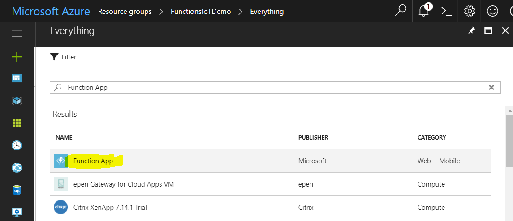
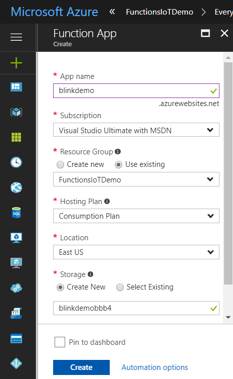
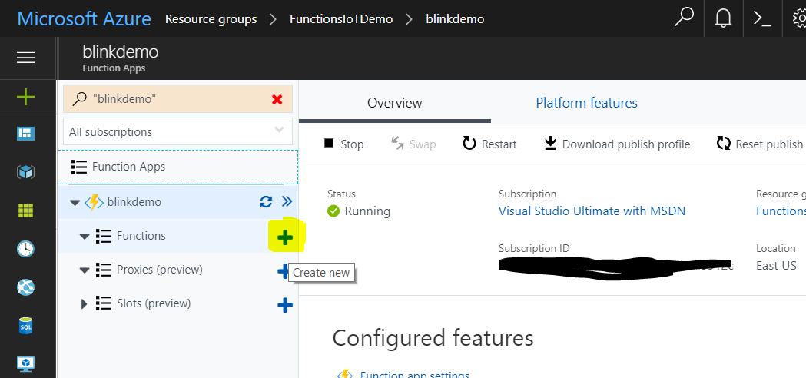
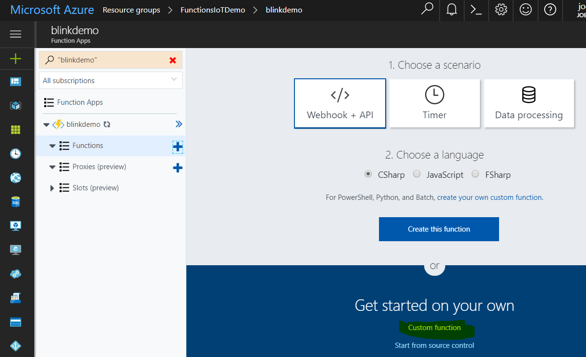
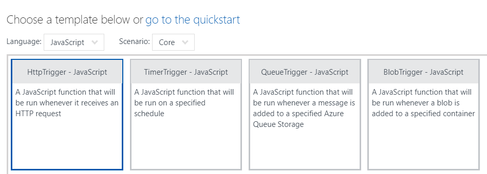
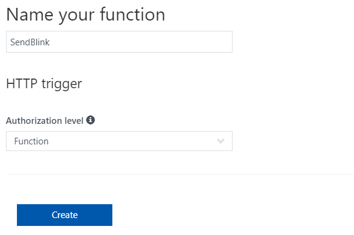
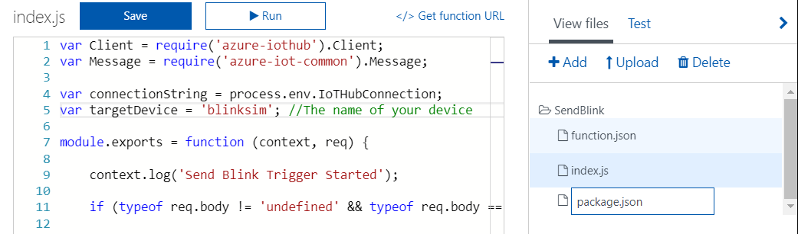
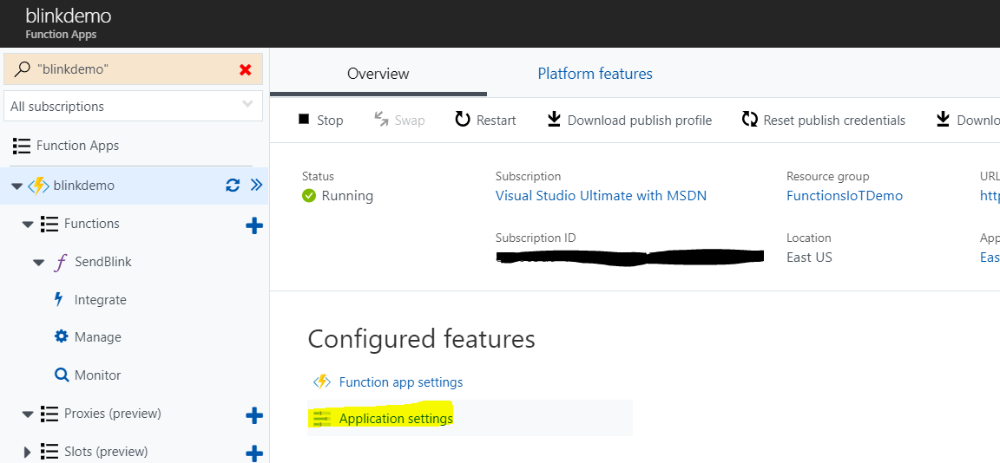
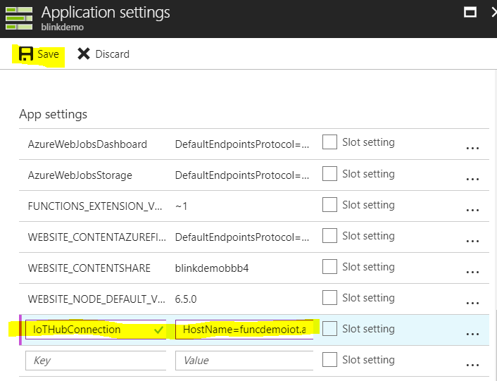

# blink(1) Azure Functions / Logic App / IoT Hub Demo # 


## Requirements ##

1. [Azure Subscription](https://azure.microsoft.com)
2. [Visual Studio Code](https://code.visualstudio.com/)
3. [Node.js](https://nodejs.org/en/)
4. [Azure Functions Core Tools](https://www.npmjs.com/package/azure-functions-core-tools) (optional)
5. [blink(1) USB device](https://blink1.thingm.com/)
6. Active [Twitter](https://www.twitter.com) Account

## Setup Instructions (in progress) ## 

Before getting started go ahead and plug in your Blink(1) into a free USB port on your computer. We will come back to the device later on. 

### 1. Setup Azure IoT Hub ###

Create a new Azure Resource Group


Create Azure IoT Hub (New -> Internet of Things -> IoT Hub)


Name your hub and make sure to choose the **FREE** pricing tier and the resource group that you created earlier. Leave all the other settings as is. 


Navigate to the Resource Group you created and you should see your IoT Hub listed. 


Click on your IoT Hub and take note of your *Hostname*. Copy it to a text file as we will be using it later. 


Select "Device Explorer" from the left column and then click "Add"


Create a unique id for your device. For this demo we will use "blinksim". Leave all the rest of the settings and hit "Save". 


The device will now show on on the previous blade. Select the device.


Copy the device's primary key and save it to a text file. We will be using it later. 


### 2. Setup Device Simulator ###

Now that we have the IoT Hub setup, we need to setup the device simulator to run locally on our machine. 

The **Receiver** folder contains our IoT Device Simulator that will receive our Cloud-To-Device message from Azure IoT Hub. 

Using VSCode, open the Receiver Folder
Rename *.env-sample* to *.env* and put in your IoT Hub settings that we saved earlier. 


Open the index.js file. You will see that we are pulling these settings securely from your .env file to create a connection string to our IoT Hub and start receiving messagines. 

```javascript
var iotHost = process.env.IOT_HOST;
var deviceKey = process.env.DEVICE_KEY;
var deviceId = process.env.DEVICE_ID;

var connectionString = 'HostName=' + iotHost +';DeviceId=' + deviceId + ';SharedAccessKey=' + deviceKey;
var client = clientFromConnectionString(connectionString);
```

Open the Integrated terminal in VS Code either by pressing CTRL+` or View -> Integrated Terminal. 


Let's install the required npm packages by typing in the following code:

```
npm install
```

We are now ready to test if the Blink(1) is setup properly and if you can receive messages from IoT Hub. Go ahead and run index.js by entering:

```
node index.js
```

If your Blink(1) is connected correctly it should blink orange twice when it first loads up. 

You should see something similar to this:

```
PS C:\Code\Blink\Receiver> node index.js
Client connected
blink 2 times rgb:ff,99,0:
set dev:0:0 to rgb:0xff,0x99,0x00 over 300 msec
set dev:0:0 to rgb:0x00,0x00,0x00 over 300 msec
set dev:0:0 to rgb:0xff,0x99,0x00 over 300 msec
set dev:0:0 to rgb:0x00,0x00,0x00 over 300 msec
```

Let's now test it out by sending a message down from IoT Hub. To do this, go back to your IoT Hub, click on the device and select "**Message to Device**".


On the following screen you will see an empty text box titled "Message Body" go ahead and type "test" in there and hit "Send Message" at the top. 


If all goes well, your light should blink and you should see out put similar to this:

```
Body: test
completed status: MessageCompleted
glimmering 3 times rgb:#0000ff:
```

3. Create Azure Function

Now that we have the IoT Hub and simulator running, let's go ahead and setup an Azure Function to send messages to IoT Hub which will in turn send a Cloud-To-Device message to our simulator. 

From within your Resource Group click "Add", search for and select "Function App". Then select "Create".



In the Function App Create screen enter a name, select your existing resource group and a location (region) and select "Create". 



Navigate to the newly created Function App and select it. Once on the Functions overview pane, click the plus sign next to "Functions" to create a new Function. 



Scroll down and select "Custom Function". 



Select "JavaScript" from the "Language" drop down and select the first one "HttpTrigger - JavaScript". 



Scroll down to name your trigger (I named mine "SendBlink"). and chooses "Anonymous" for "Authorization level". Note; we normally would not do this but we are for demo purposes only. Click Create.



You will now be taken to a screen allowing you to edit your function. Delete all existing code and paste in the code from index.js in this repo and hit "Save". (below)

```javascript
var Client = require('azure-iothub').Client;
var Message = require('azure-iot-common').Message;

var connectionString = process.env.IoTHubConnection;
var targetDevice = 'blinksim'; //The name of your device

module.exports = function (context, req) {

    context.log('Send Blink Trigger Started');

    if (typeof req.body != 'undefined' && typeof req.body == 'object') {

        var myReq = req.body;

        var client = Client.fromConnectionString(connectionString);
        client.open(function (err) {
        if (err) {
            context.log('Could not connect: ' + err.message);
        } else {
            context.log('Client connected');
        
            // Create a message and send it to the device
            var data = myReq.msg;
            var message = new Message(data);
            context.log('Sending message: ' + message.getData() + ' to: ' + targetDevice);
            client.send(targetDevice, message, printResultFor('send', context));
        }
        context.done();
        });

    }    

};

function printResultFor(op, context) {
    return function printResult(err, res) {
        if (err) context.log(op + ' error: ' + err.toString());
        if (res) context.log(op + ' status: ' + res.constructor.name);
    };
}
```

The only code you will have to change is line 5. The targetDevice variable must contain the name of your device from earlier. 

```javascript
var connectionString = process.env.IoTHubConnection;
var targetDevice = 'blinksim'; //The name of your device
```

Now we need to add the package.json containing the npm packages required to connect to Azure IoT Hub. To do this click on "View Files" on the right and then click "Add". Type in "package.json" and hit enter.



It will automatically take you into the package.json file. Paste the code below (which is also found in the repo) and hit save. 

```json
{
  "name": "sendblink",
  "version": "1.0.0",
  "description": "",
  "main": "index.js",
  "author": "",
  "license": "ISC",
  "dependencies": {
    "azure-iothub": "^1.1.14"
  }
}
```

The last step is to add the IoT Hub connection to our application settings for the Function to use. 

Click on the name of your Function on the left hand side and then choose "Application Settings".



Scroll down to "App Settings" and add a new one called "IoTHubConnection" with your IoT Hub Connection string that we saved earlier. 




## Workshop (coming soon) ## 

TODO: Create Azure CLI Version
TODO: Save IoTHub Connection String (IoTHubOwner)

## Resources ##

 - Coming soon... 
