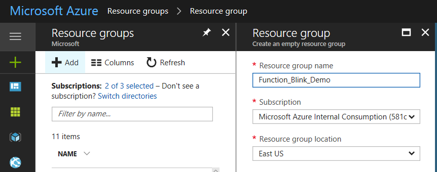

# blink(1) Azure Functions / Logic App / IoT Hub Demo # 


## Requirements ##

1. [Azure Subscription](https://azure.microsoft.com)
2. [Visual Studio Code](https://code.visualstudio.com/)
3. [Node.js](https://nodejs.org/en/)
4. [Azure Functions Core Tools](https://www.npmjs.com/package/azure-functions-core-tools) (optional)
5. [blink(1) USB device](https://blink1.thingm.com/)
6. Active [Twitter](https://www.twitter.com) Account

## Setup Instructions (in progress) ## 

Before getting started go ahead and plug in your Blink(1) into a free USB port on your computer. We will come back to the device later on. 

### 1. Setup Azure IoT Hub ###

Create a new Azure Resource Group



Create Azure IoT Hub (New -> Internet of Things -> IoT Hub)


Name your hub and make sure to choose the **FREE** pricing tier and the resource group that you created earlier. Leave all the other settings as is. 


Navigate to the Resource Group you created and you should see your IoT Hub listed. 


Click on your IoT Hub and take note of your *Hostname*. Copy it to a text file as we will be using it later. 


Select "Device Explorer" from the left column and then click "Add"


Create a unique id for your device. For this demo we will use "blinksim". Leave all the rest of the settings and hit "Save". 


The device will now show on on the previous blade. Select the device.


Copy the device's primary key and save it to a text file. We will be using it later. 


### 2. Setup Device Simulator ###

Now that we have the IoT Hub setup, we need to setup the device simulator to run locally on our machine. 

The **Receiver** folder contains our IoT Device Simulator that will receive our Cloud-To-Device message from Azure IoT Hub. 

Using VSCode, open the Receiver Folder
Rename *.env-sample* to *.env* and put in your IoT Hub settings that we saved earlier. 


Open the index.js file. You will see that we are pulling these settings securely from your .env file to create a connection string to our IoT Hub and start receiving messagines. 

```
var iotHost = process.env.IOT_HOST;
var deviceKey = process.env.DEVICE_KEY;
var deviceId = process.env.DEVICE_ID;

var connectionString = 'HostName=' + iotHost +';DeviceId=' + deviceId + ';SharedAccessKey=' + deviceKey;
var client = clientFromConnectionString(connectionString);
```

Open the Integrated terminal in VS Code either by pressing CTRL+` or View -> Integrated Terminal. 


Let's install the required npm packages by typing in the following code:

```
npm install
```

We are now ready to test if the Blink(1) is setup properly and if you can receive messages from IoT Hub. Go ahead and run index.js by entering:

```
node index.js
```

If your Blink(1) is connected correctly it should blink orange twice when it first loads up. 

You should see something similar to this:

```
PS C:\Code\Blink\Receiver> node index.js
Client connected
blink 2 times rgb:ff,99,0:
set dev:0:0 to rgb:0xff,0x99,0x00 over 300 msec
set dev:0:0 to rgb:0x00,0x00,0x00 over 300 msec
set dev:0:0 to rgb:0xff,0x99,0x00 over 300 msec
set dev:0:0 to rgb:0x00,0x00,0x00 over 300 msec
```

Let's now test it out by sending a message down from IoT Hub. To do this, go back to your IoT Hub, click on the device and select "**Message to Device**".


On the following screen you will see an empty text box titled "Message Body" go ahead and type "test" in there and hit "Send Message" at the top. 


If all goes well, your light should blink and you should see out put similar to this:

```
Body: test
completed status: MessageCompleted
glimmering 3 times rgb:#0000ff:
```

## Workshop (coming soon) ## 

For a step by step workshop version of this demo please visit the following link: coming soon. 

1. Install required applications
2. Create IoT Hub & Setup Device
3. Create Function App & Publish to Azure
4. Create Logic App & Send to Function
5. Add additional logic apps

## Resources ##

 - Coming soon... 
